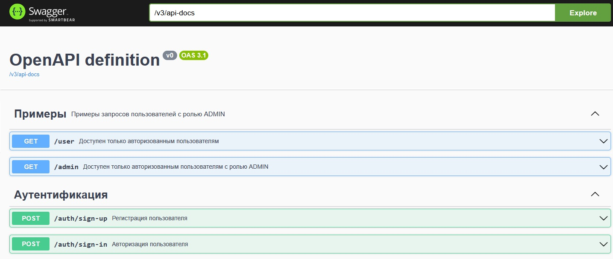
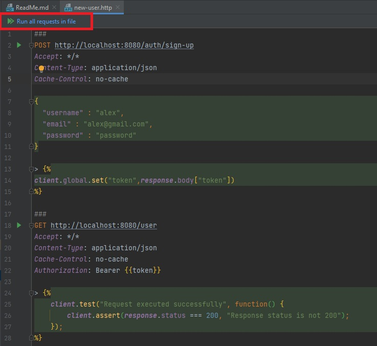
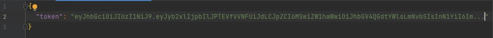
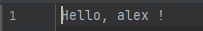
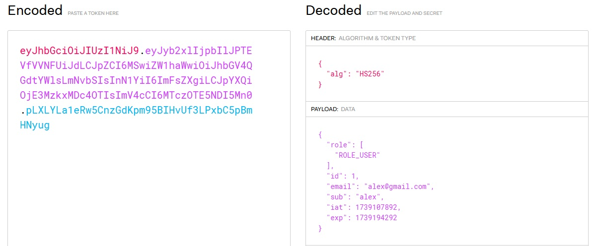
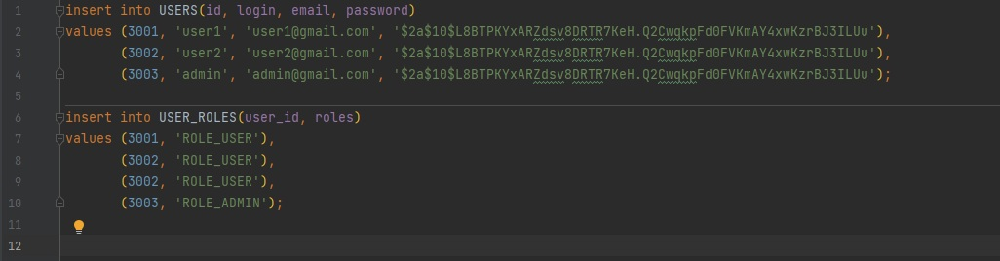
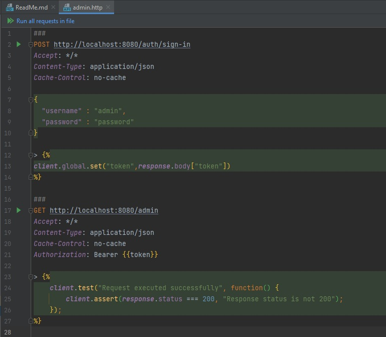
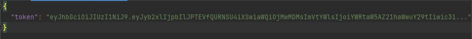
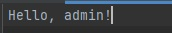

**JWT Аутентификация** 

**Как воспроизвести работу приложения**

После клонирования проекта выполнить команду _mvn package_ и затем попустить приложение с помощью команды

`java -jar ./target/jwtAuth-1.0-SNAPSHOT.jar`

Графическое описание rest-методов доступно по http://localhost:8080/swagger-ui/index.html

**Создание нового пользователя.**

Http запросы доступны в файле **new-user.http**. Запустить скрипт нажав на "Run all requests in file"

Ответ на запрос регистрации нового пользователя

Далее отправляется запрос на endpoint для авторизованных пользователей с полученным токеном. Ответ:

Содержимое декодированного токена:

**Авторизация пользователя с админской ролью.**

При старте приложения осуществляется добавление пользователей в базу h2 из файла resources/data.sql.

Http запросы доступны в файле **admin.http**. Запустить скрипт нажав на "Run all requests in file"

Ответ на запрос авторизации существующего пользователя

Далее отправляется запрос на endpoint для авторизованных пользователей с админской ролью с полученным токеном. Ответ:

